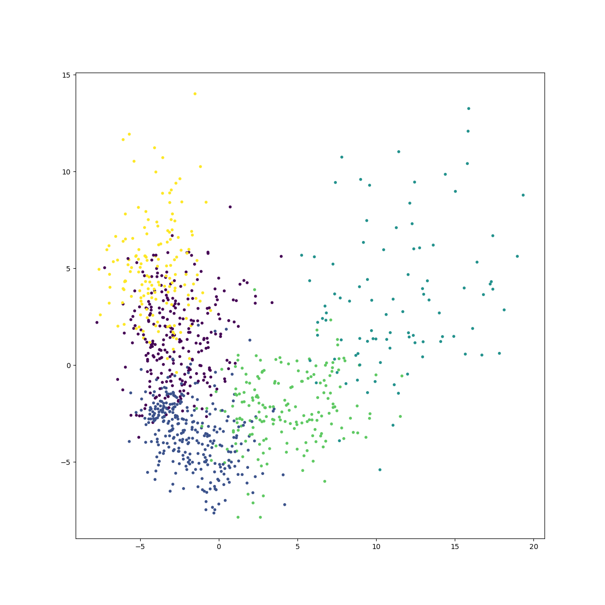
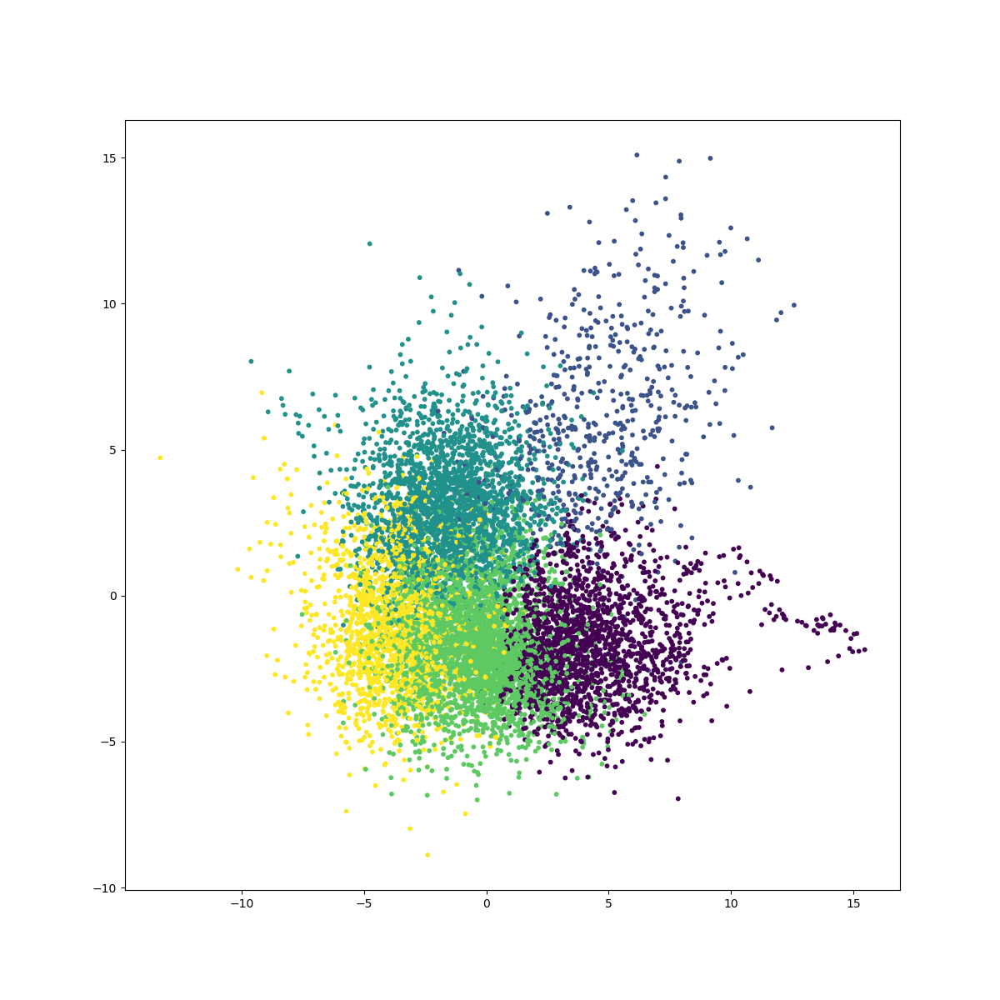
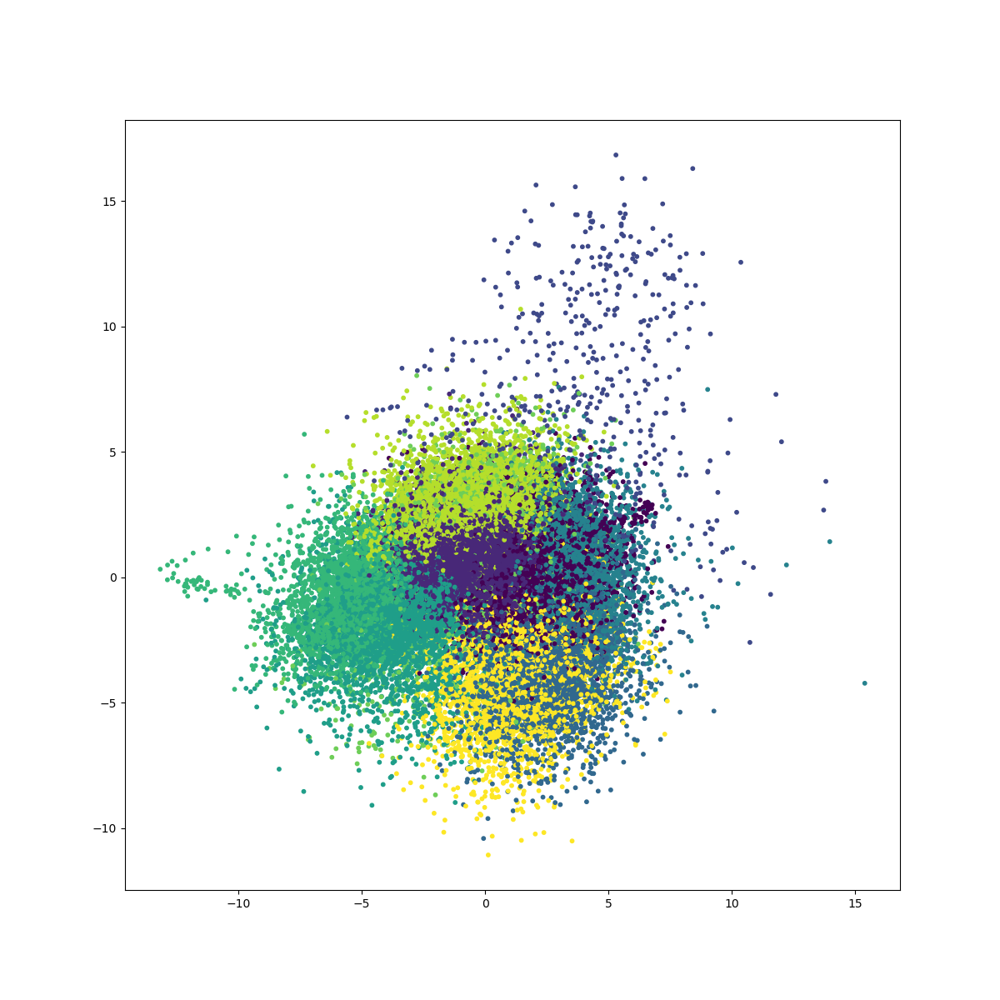

# xdd-topic-modeling

### Clustering for finding topic keywords
- K-means clustering on the doc2vec embeddings of a set of articles
- Top N frequent words from the article titles of each cluster of as the topic keywords of this cluster

#### sample_size=1k, clusters=5, keywords=5
```
Cluster Count   Keywords
3       186     ['health', 'COVID-19:', 'respiratory', 'human', 'New']
1       304     ['human', 'viral', 'health', 'COVID-19:', 'China']
2       95      ['Beijing', 'Municipal', 'Bureau', 'human', 'health']
0       263     ['COVID-19:', 'human', 'clinical', 'viral', 'influenza']
4       152     ['Health', 'COVID‐19', 'COVID-19:', 'cells', 'outbreak']
```


---
#### sample_size=10k, clusters=5, keywords=5
```
Cluster Count   Keywords
2       2293    ['respiratory', 'COVID-19:', 'health', 'human', 'detection']
3       3409    ['respiratory', 'COVID-19:', 'health', 'viral', 'human']
1       581     ['health', 'respiratory', 'COVID-19:', 'Beijing', 'review']
0       1875    ['health', 'respiratory', 'human', 'review', 'COVID-19:']
4       1842    ['COVID-19:', 'health', 'respiratory', 'RNA', 'COVID‐19']
```


---
#### sample_size=50k, clusters=5, keywords=10
```
Cluster Count   Keywords
0       7991    ['health', 'COVID-19:', 'respiratory', 'human', 'COVID‐19', 'using', 'review', 'RNA', 'viral', 'detection']
2       23960   ['respiratory', 'COVID-19:', 'health', 'human', 'COVID‐19', 'viral', 'review', 'using', '2019', 'syndrome']
1       8230    ['respiratory', 'health', 'COVID-19:', 'COVID‐19', 'human', 'using', 'review', 'China', 'cells', 'Health']
3       9308    ['respiratory', 'health', 'COVID-19:', 'RNA', 'COVID‐19', 'review', 'human', 'viral', 'Health', 'using']
4       511     ['Clinical', 'COVID‐19', 'cancer', 'respiratory', 'health', 'response', 'cells', 'care', 'potential', '2019']
```


---
#### sample_size=50k, clusters=10, keywords=10
```
Cluster Count   Keywords
5       3233    ['respiratory', 'COVID-19:', 'human', 'health', 'Health', 'review', 'COVID‐19', 'China', 'severe', 'Respiratory']
1       12409   ['respiratory', 'COVID-19:', 'health', 'human', 'COVID‐19', 'viral', 'using', 'review', 'syndrome', 'cells']
7       3515    ['respiratory', 'health', 'COVID-19:', 'COVID‐19', 'review', 'cancer', 'viral', 'human', 'RNA', 'New']
8       6385    ['respiratory', 'COVID-19:', 'health', 'COVID‐19', 'review', 'using', 'human', 'viral', 'RNA', 'clinical']
9       4244    ['respiratory', 'health', 'COVID-19:', 'human', 'using', 'viral', 'RNA', 'COVID‐19', 'detection', 'cancer']
4       5160    ['respiratory', 'health', 'COVID-19:', 'RNA', 'review', 'viral', 'novel', 'Health', 'cancer', 'using']
6       3992    ['health', 'respiratory', 'COVID‐19', 'COVID-19:', 'using', 'human', 'cells', 'review', 'Health', 'infectious']
0       6736    ['respiratory', 'COVID-19:', 'human', 'health', 'COVID‐19', 'viral', 'review', 'China', '2019', 'Health']
3       3851    ['COVID-19:', 'health', 'respiratory', 'COVID‐19', 'review', 'COVID', 'cells', 'human', 'using', 'Respiratory']
2       475     ['Clinical', 'COVID‐19', 'respiratory', 'health', 'cells', 'care', 'Viral', 'COVID', 'cancer', 'related']
```