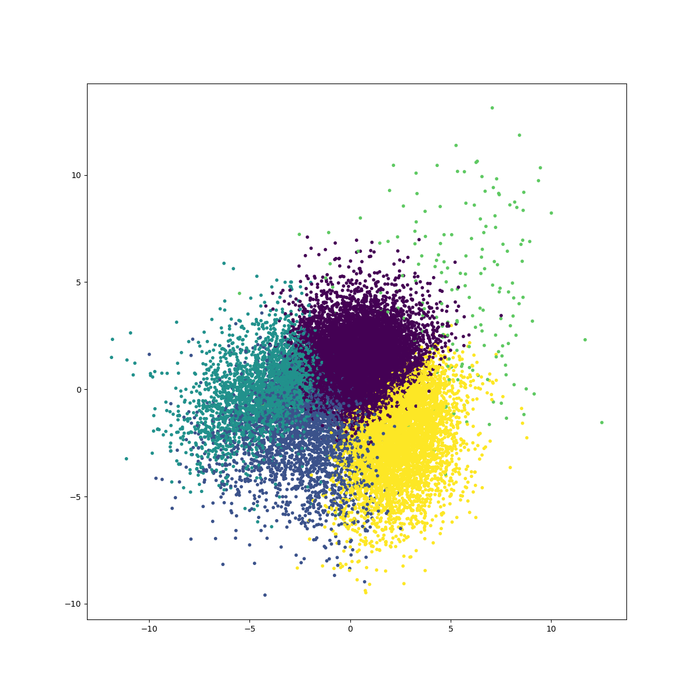

# xdd-topic-modeling

### Clustering for finding topic keywords
- K-means clustering on the doc2vec embeddings of a set of articles
- Top N frequent words from the article titles of each cluster of as the topic keywords of this cluster

#### sample_size=1k, clusters=5, keywords=5
```
Cluster Count   Keywords
3       186     ['health', 'COVID-19:', 'respiratory', 'human', 'New']
1       304     ['human', 'viral', 'health', 'COVID-19:', 'China']
2       95      ['Beijing', 'Municipal', 'Bureau', 'human', 'health']
0       263     ['COVID-19:', 'human', 'clinical', 'viral', 'influenza']
4       152     ['Health', 'COVID‐19', 'COVID-19:', 'cells', 'outbreak']
```


---
#### sample_size=10k, clusters=5, keywords=5
```
Cluster Count   Keywords
2       2293    ['respiratory', 'COVID-19:', 'health', 'human', 'detection']
3       3409    ['respiratory', 'COVID-19:', 'health', 'viral', 'human']
1       581     ['health', 'respiratory', 'COVID-19:', 'Beijing', 'review']
0       1875    ['health', 'respiratory', 'human', 'review', 'COVID-19:']
4       1842    ['COVID-19:', 'health', 'respiratory', 'RNA', 'COVID‐19']
```


---
#### sample_size=50k, clusters=5, keywords=10
```
Cluster Count   Keywords
0       7991    ['health', 'COVID-19:', 'respiratory', 'human', 'COVID‐19', 'using', 'review', 'RNA', 'viral', 'detection']
2       23960   ['respiratory', 'COVID-19:', 'health', 'human', 'COVID‐19', 'viral', 'review', 'using', '2019', 'syndrome']
1       8230    ['respiratory', 'health', 'COVID-19:', 'COVID‐19', 'human', 'using', 'review', 'China', 'cells', 'Health']
3       9308    ['respiratory', 'health', 'COVID-19:', 'RNA', 'COVID‐19', 'review', 'human', 'viral', 'Health', 'using']
4       511     ['Clinical', 'COVID‐19', 'cancer', 'respiratory', 'health', 'response', 'cells', 'care', 'potential', '2019']
```


---
#### sample_size=50k, clusters=10, keywords=10
```
Cluster Count   Keywords
5       3233    ['respiratory', 'COVID-19:', 'human', 'health', 'Health', 'review', 'COVID‐19', 'China', 'severe', 'Respiratory']
1       12409   ['respiratory', 'COVID-19:', 'health', 'human', 'COVID‐19', 'viral', 'using', 'review', 'syndrome', 'cells']
7       3515    ['respiratory', 'health', 'COVID-19:', 'COVID‐19', 'review', 'cancer', 'viral', 'human', 'RNA', 'New']
8       6385    ['respiratory', 'COVID-19:', 'health', 'COVID‐19', 'review', 'using', 'human', 'viral', 'RNA', 'clinical']
9       4244    ['respiratory', 'health', 'COVID-19:', 'human', 'using', 'viral', 'RNA', 'COVID‐19', 'detection', 'cancer']
4       5160    ['respiratory', 'health', 'COVID-19:', 'RNA', 'review', 'viral', 'novel', 'Health', 'cancer', 'using']
6       3992    ['health', 'respiratory', 'COVID‐19', 'COVID-19:', 'using', 'human', 'cells', 'review', 'Health', 'infectious']
0       6736    ['respiratory', 'COVID-19:', 'human', 'health', 'COVID‐19', 'viral', 'review', 'China', '2019', 'Health']
3       3851    ['COVID-19:', 'health', 'respiratory', 'COVID‐19', 'review', 'COVID', 'cells', 'human', 'using', 'Respiratory']
2       475     ['Clinical', 'COVID‐19', 'respiratory', 'health', 'cells', 'care', 'Viral', 'COVID', 'cancer', 'related']
```

### Clustering for finding topic keywords with abstract
- K-means clustering on the doc2vec embeddings of a set of articles
- 25k abstracts extracted out of 104k articles with a strict string matching method
- Top N frequent words from the article abstracts of each cluster of as the topic keywords of this cluster

#### sample_size=15k, clusters=5, keywords=10, field=abstract
```
Cluster Count   Keywords
0       14602   ['cells', 'cell', 'University', 'using', 'blood', 'also', 'may', 'treatment', 'expression', 'group']
1       2775    ['cells', 'University', 'bone', 'using', 'cell', 'also', 'Medicine,', 'expression', 'increased', 'may']
4       6026    ['cells', 'University', 'cell', 'using', 'treatment', 'Medicine,', 'bone', 'group', 'compared', 'may']
2       3023    ['University', 'cells', 'using', 'blood', 'cell', 'treatment', 'clinical', 'Medicine,', 'also', 'group']
3       182     ['language', 'preprint', 'online', 'using', 'anxiety', 'may', 'Abstract', 'immunity', 'viral', '2020']
```


---

#### sample_size=15k, clusters=5, keywords=10, field=title
```
Cluster Count   Keywords
0       14602   ['respiratory', 'review', 'human', 'COVID-19:', 'using', 'health', 'COVID‐19', 'among', 'clinical', 'novel']
1       2775    ['respiratory', 'health', 'COVID-19:', 'review', 'cells', 'using', 'human', 'care', 'acute', 'RNA']
4       6026    ['respiratory', 'COVID-19:', 'review', 'health', 'using', 'human', 'clinical', 'novel', 'viral', 'case']
2       3023    ['respiratory', 'using', 'health', 'review', 'human', 'COVID-19:', 'viral', 'clinical', 'cells', 'model']
3       182     ['health', 'potential', 'care', 'response', 'COVID‐19', 'Novel', 'feline', 'detection', 'human', 'role']
```


---
### Abstracts from Science Parser
#### sample_size=50k, clusters=10, keywords=10, field=abstract
Keywords from frequency
```
Cluster Count   Keywords
9       3183    ['health', 'also', 'may', 'viral', 'respiratory', 'clinical', 'used', 'risk', '2020', 'data']
1       15044   ['health', 'also', 'may', 'viral', 'respiratory', 'clinical', 'using', 'University', 'used', 'data']
6       4384    ['also', 'health', 'may', 'respiratory', 'viral', 'clinical', 'used', 'using', 'data', 'human']
4       6902    ['health', 'also', 'may', 'viral', 'clinical', 'respiratory', 'risk', 'data', '2020', 'using']
5       3716    ['health', 'also', 'may', 'viral', 'respiratory', 'data', 'using', 'clinical', 'University', 'used']
3       4147    ['health', 'also', 'may', 'clinical', 'viral', 'respiratory', '2020', 'used', 'data', 'cases']
2       3963    ['health', 'may', 'also', 'respiratory', 'viral', 'clinical', 'University', 'risk', 'data', 'using']
0       3919    ['also', 'health', 'may', 'clinical', 'respiratory', 'viral', 'cells', 'used', 'data', 'risk']
8       4302    ['health', 'also', 'may', 'viral', 'respiratory', 'clinical', 'human', 'data', 'used', 'using']
7       440     ['may', 'also', 'viral', 'respiratory', 'clinical', 'research', 'health', 'cases', '2020', 'using']
```

Keywords from TF-IDF
```
Cluster Count   Keywords
9       3183    ['preprint', 'vaccine', 'des', 'air', 'SARS', 'binding', 'children', 'RNA', 'ACE2', 'mental']
1       15044   ['preprint', 'influenza', 'ACE2', 'al.,', 'cancer', 'USA', 'children', 'mental', 'SARS', 'vaccine']
6       4384    ['preprint', 'al.,', 'influenza', 'SARS', 'ACE2', 'vaccine', 'School', 'cancer', 'RNA', 'China']
4       6902    ['preprint', 'cancer', 'al.,', 'USA', 'influenza', 'ACE2', 'children', 'RNA', 'mental', 'students']
5       3716    ['influenza', 'preprint', 'MD,', 'viruses', 'Hong', 'women', 'al.,', 'ACE2', 'children', 'compounds']
3       4147    ['preprint', 'influenza', 'al.,', 'ACE2', 'students', 'mental', 'children', 'MD,', 'SARS-CoV', 'USA']
2       3963    ['preprint', 'USA', 'al.,', 'MD,', 'influenza', 'University,', 'China', 'vaccine', 'children', 'cancer']
0       3919    ['preprint', 'al.,', 'USA', 'RNA', 'IgG', 'influenza', 'Medicine,', 'vaccine', 'cancer', 'mental']
8       4302    ['preprint', 'influenza', 'University,', 'RNA', 'Department', 'al.,', 'Medicine,', 'ACE2', 'DNA', 'USA']
7       440     ['preprint', 'School', 'influenza', 'al.,', 'proteins', 'children', 'RNA', 'USA', 'DNA', '2020;']
```
---